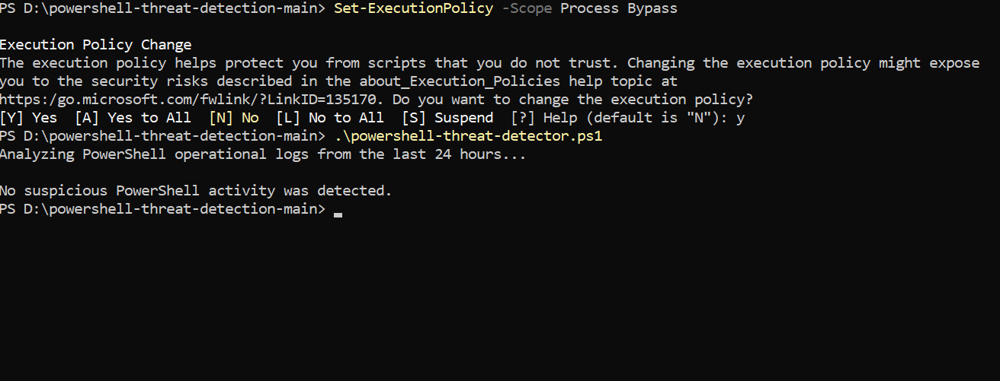

# PowerShell Threat Detection

A defensive cybersecurity project that analyzes Windows PowerShell operational logs for suspicious activity and maps findings to MITRE ATT&CK techniques.

## Features

- Reads PowerShell Event IDs 4103 and 4104
- Detects encoded PowerShell commands
- Detects execution-policy bypass attempts
- Detects hidden PowerShell windows
- Detects suspicious download commands
- Detects `Invoke-Expression`
- Detects credential-related commands
- Detects persistence-related commands
- Assigns severity levels
- Maps findings to MITRE ATT&CK
- Exports findings to a CSV report

## Detection Rules

| Detection | Severity | MITRE ATT&CK |
|---|---:|---|
| Encoded PowerShell command | High | T1059.001 |
| Execution-policy bypass | Medium | T1059.001 |
| Hidden PowerShell window | Medium | T1059.001 |
| Suspicious download command | High | T1105 |
| Invoke-Expression use | High | T1059.001 |
| Credential-related command | High | T1003 |
| Persistence-related command | Medium | T1053, T1543 |

## Requirements

- Windows 10 or Windows 11
- PowerShell 5.1 or newer
- Administrator privileges
- PowerShell operational logging enabled

## How to Run

Open Windows PowerShell as Administrator.

Navigate to the project folder:

```powershell
cd "C:\path\to\powershell-threat-detection"
```

Allow the script for the current PowerShell session:

```powershell
Set-ExecutionPolicy -Scope Process Bypass
```

Run the detector:

```powershell
.\powershell-threat-detector.ps1
```

Analyze a longer period:

```powershell
.\powershell-threat-detector.ps1 -HoursBack 48
```

## Output

If suspicious activity is found, the script creates:

```text
powershell-threat-report.csv
```

If no suspicious activity is found, the script reports a clean result.

## Test Result

The detector was tested successfully against the local PowerShell operational log.



## Disclaimer

This project is intended only for educational, defensive, and authorized cybersecurity use.
